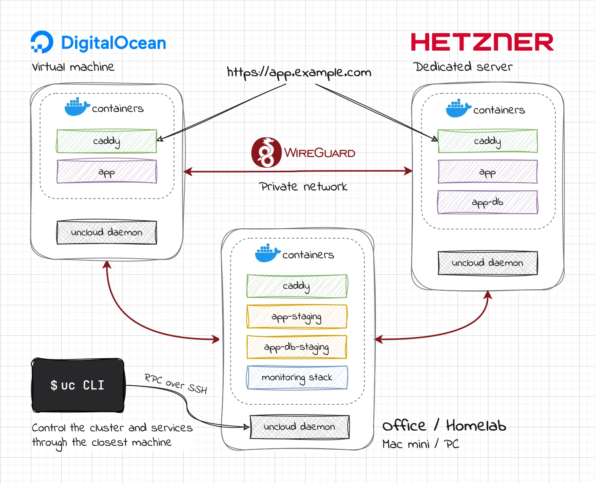

<div align="center">
  
  <h1>Uncloud</h1>
  <p><strong>Docker simplicity. Multi-machine power.</strong></p>
</div>

Uncloud is a lightweight clustering and container orchestration tool that lets you deploy and manage web apps across
cloud VMs and bare metal with minimized cluster management overhead. It creates a secure WireGuard mesh network between
your Docker hosts and provides automatic service discovery, load balancing, ingress with HTTPS, and simple CLI commands
to manage your apps.

Unlike traditional orchestrators, there's no central control plane and quorum to maintain. Each machine maintains a
synchronized copy of the cluster state through peer-to-peer communication, keeping cluster operations functional even if
some machines go offline.

Uncloud aims to be the solution for developers who want the flexibility of self-hosted infrastructure without the
operational complexity of Kubernetes.

## ✨ Features

* **Deploy anywhere**: Combine cloud VMs, dedicated servers, and bare metal into a unified computing environment —
  regardless of location or provider.
* **Zero-config private network**: Automatic WireGuard mesh with peer discovery and NAT traversal. Containers get unique
  IPs for direct cross-machine communication.
* **No control plane**: Fully decentralized design eliminates single points of failure and reduces operational overhead.
* **Imperative over declarative**: Favoring imperative operations over state reconciliation simplifies both the mental
  model and troubleshooting.
* **Service discovery**: Built-in DNS server resolves service names to container IPs.
* **Automatic HTTPS**: Built-in Caddy reverse proxy handles TLS certificate provisioning and renewal using Let's
  Encrypt.
* **Docker-like CLI**: Familiar commands for managing both infrastructure and applications.
* **Remote management**: Control your entire infrastructure through SSH access to any single machine in the cluster.

Coming soon:

* Project isolation through environments/namespaces
* Infrastructure as Code using Docker Compose format
* Persistent volumes and secrets management
* Monitoring and log aggregation
* Database deployment and management
* Curated application catalog

Here is a diagram of an Uncloud multi-provider cluster of 3 machines:



## 💫 Why Uncloud?

Modern cloud platforms like Heroku and Render offer amazing developer experiences but at a premium price. Traditional
container orchestrators like Kubernetes provide power and flexibility but require significant operational expertise. I
believe there's a sweet spot in between — a pragmatic solution for the majority of us who aren't running at Google
scale. You should be able to:

* **Own your infrastructure and data**: Whether driven by costs, compliance, or flexibility, run applications on any
  combination of cloud VMs and personal hardware while maintaining the cloud-like experience you love.
* **Stay simple**: Don't worry about control planes, highly-available clusters, or complex YAML configurations for
  common use cases.
* **Build with proven primitives**: Get production-grade networking, deployment primitives, service discovery, load
  balancing, and ingress with HTTPS out of the box without becoming a distributed systems expert.
* **Support sustainable computing** 🌿: Minimize system overhead to maximize resources available for your applications.

Uncloud's goal is to make deployment and management of containerized applications feel as seamless as using a cloud
platform, whether you're running on a $5 VPS, a spare Mac mini, or a rack of bare metal servers.

## 🚀 Quick start

1. Install Uncloud CLI:

```bash
curl -fsS https://get.uncloud.run/install.sh | sh
```

2. Initialize your first machine:

```bash
uc machine init root@your-server-ip
```

3. Create a DNS A record pointing `app.example.com` to your server's IP address, then deploy your app with automatic
   HTTPS:

```bash
uc run --name my-app -p app.example.com:8000/https registry/app
```

That's it! Your app is now running and accessible at https://app.example.com ✨

## 🏗 Project status

Uncloud is currently in active development and is **not ready for production use**. Features may change significantly
and there may be breaking changes between releases.

I'd love your input:

* 🐛 Found a bug? [Open an issue](https://github.com/psviderski/uncloud/issues)
* 💡 Have ideas? [Join the discussion](https://github.com/psviderski/uncloud/discussions)

## 📫 Stay updated

* [Subscribe](https://uncloud.run/#subsribe) to my newsletter to follow the progress, get early insights into new
  features, and be the first to know when it's ready for production use.
* Watch this repository for releases.
* Follow [@psviderski](https://github.com/psviderski) on GitHub.

